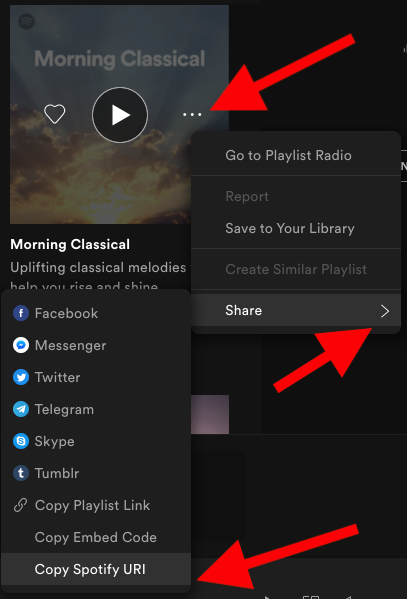
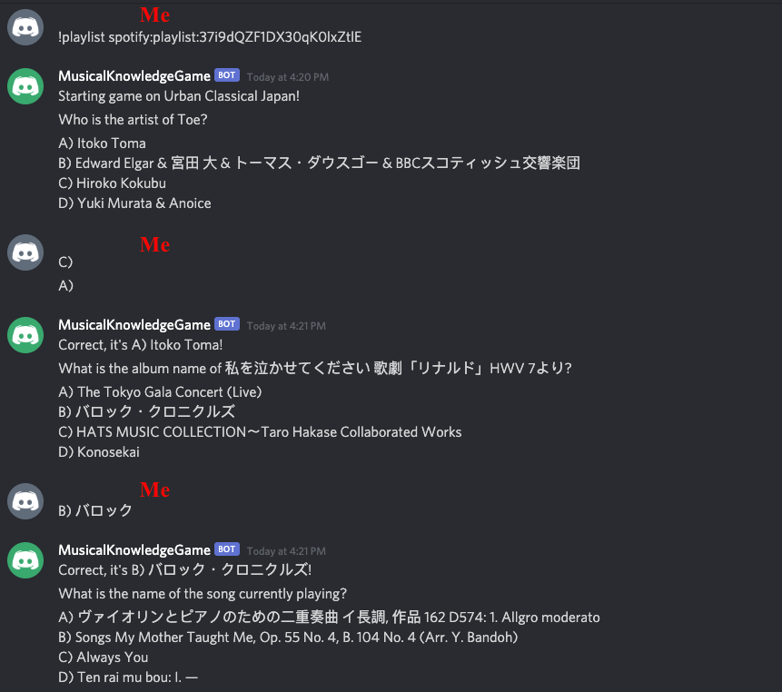
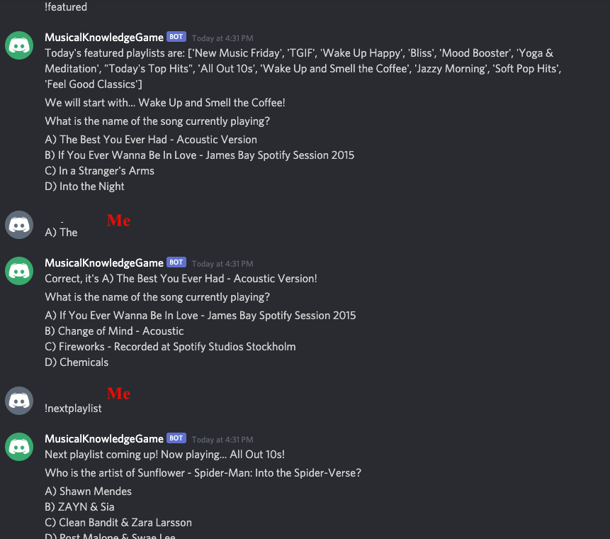

#Musical Knowledge Game
##What is it?
Musical Knowledge Game is a Discord bot where you can play games on Spotify playlists. 

You can compete against your friends, test your own knowledge or kill time, whatever you want, this is a must-add for any Discord server!

##Game Modes
Make sure to join a voice channel when playing this game. It's a *music* game after all!
1. Enter `!featured` to play a random playlist from Spotify's featured playlists.
    * **Note**: According to a Spotify admin, 
      > We recently changed the way some of our Spotify-curated playlists work, so that now they will be personalized according to individual users' tastes and listening habits.
      >
      > In practice, this means that the same Spotify playlist can contain different songs depending on the user who is viewing the playlist. It looks like this is the case for Essential Indie.
  
      Essentially, it means that songs from any playlists created by Spotify may be different for different users.
    * The game will randomly choose a playlist out of today's featured playlists. To move on to the next game, type `!nextplaylist` or `!n` for short
1. Enter `!playlist spotify_uri` to play a specific playlist
    * You can find the Spotify URI of a playlist here:
    
    * For example, `!playlist spotify:playlist:37i9dQZF1DX30qK0lxZtlE` will play a specific playlist.
    * The `!nextplaylist` command will not be used for this game mode.

##Question Types
All the questions are multiple choice questions. To enter, make sure to answer at least the option name - either A), B), C) or D)

For example, the following formats are valid:
  * `A)`
  * `A) Answer`
  * `A) Ans`

The following are **NOT** valid:
  * `A`
  * `Answer`
  
**Types of Questions**
1.  `What is the album name of X?` 
2.  `Who is the artist of song X?`
3.  `What is the name of the song currently playing?` (in the voice channel)

##Sample Gameplay
**Specific playlist**

**Featured playlists**

##Known Issues
  * For "What is the name of this song" game mode, sometimes the wrong song may be fetched. In that case, please simply 
  guess all the possibilities - A), B), C), D). One of them will be correct.